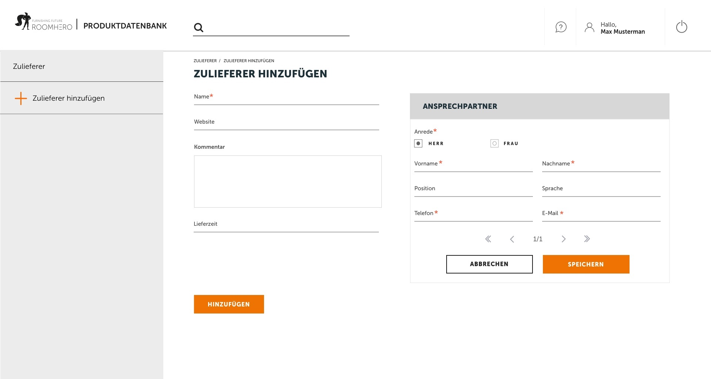

### React Redux-Thunk Task for Roomhero

#### Installation (this app needs yarn)
```
- npm install yarn: https://www.npmjs.com/package/yarn

- yarn
- yarn start
```
- the application will automatically open on port 8080.



#### Short UX Description

The page shows up the custom Material-UI navbar of Roomhero CI. Aside is the drawer panel with the entry: "Zulieferer hinzufügen". With a click on it opens the first tab "Zulieferer" and appears two forms on the middle of the screen "Zulieferer hinzufügen" and "Ansprechpartner".
Now is the possibility to set up the two forms and save the forms in object wise to the Redux Store. The current workflow of saving up stuff is to first fill out the "Ansprechpartner" then save it with the "Speichern" button and after the "Zulieferer hinzufügen" form. At the end click on the "Hinzufügen" button to kick the data to their journey in the redux network.
It's also possible to attach or create infinite "Zulieferer" with the "Zulieferer hinzufügen" side tab and populate it with data.

#### Implemented technologies in this project

- Redux-Thunk with Material-UI
- SASS SCSS preprocessoring with node-sass
- Bson Object-Id creator
- Enzyme-Jest unit & integration test
- Eslint Codelinter

##### Enzyme-Jest
```
- yarn test
- yarm test:watch
```

##### Eslint
```
- yarn lint
```


